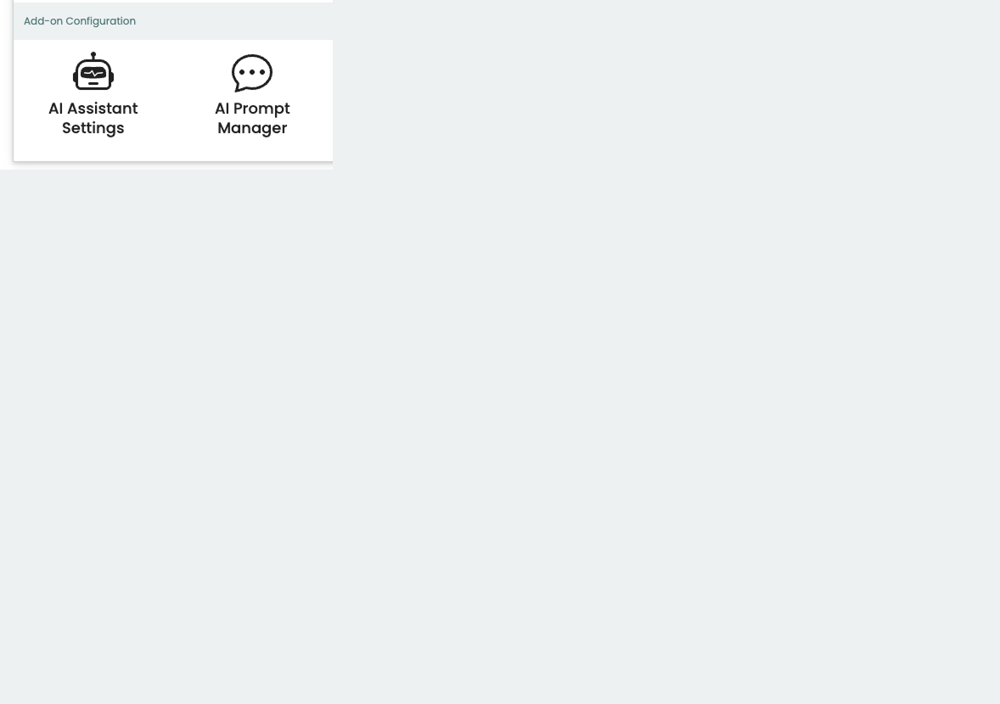
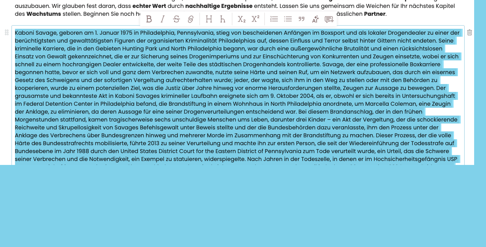
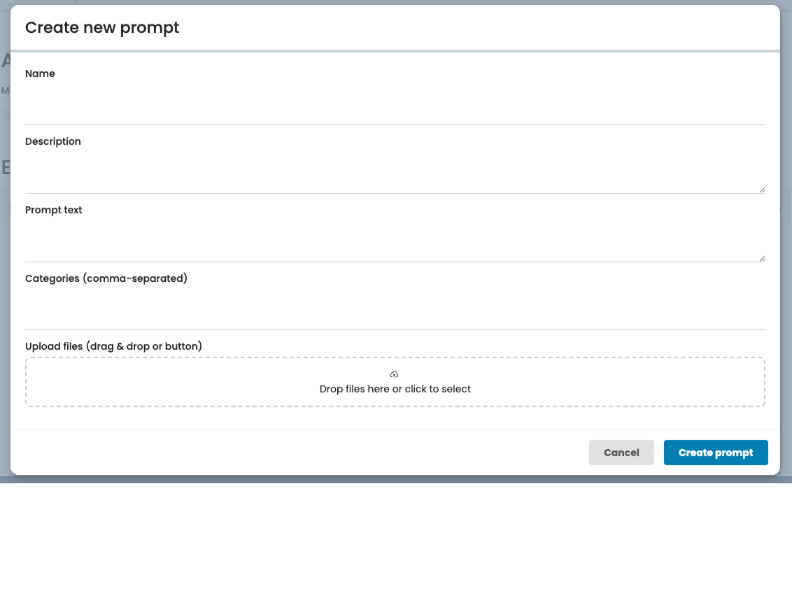
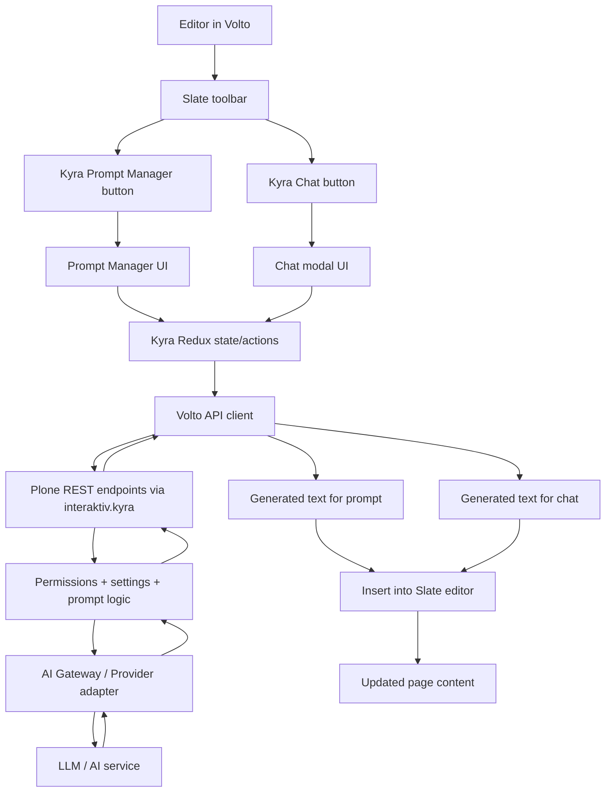

# volto-interaktiv-kyra

Kyra AI for Volto — a modern, editor-first AI add-on for structured prompts, smart settings
and seamless Slate workflows.

volto-interaktiv-kyra brings Kyra’s AI features into Volto with a polished, production-ready UI.
It empowers editors with a curated Prompt Manager, configurable AI Settings,
and dedicated Slate toolbar entry points for both prompt-based assistance and optional free-text chat.

Repositories
- Frontend: https://github.com/interaktivgmbh/volto-interaktiv-kyra
- Backend prerequisite: https://github.com/interaktivgmbh/interaktiv.kyra

## Why Kyra for Volto?

- editor-first UX with clear, separated workflows
- curated prompts for consistent content quality
- optional free-text chat for fast ad-hoc tasks
- centralized configuration via backend-driven settings
- clean integration into the Slate toolbar

---

## Showcase

- AI Settings control panel
  

- Prompt Manager UI
  

- Slate editor toolbar with two AI buttons
  

---

## What this add-on provides

The add-on focuses on three user-facing areas:

1. AI Settings UI
2. Prompt Manager UI
3. Editor integrations (Slate), including:
   - prompt-based insertion
   - free-text chat

It is designed to be usable in projects that want:
- a curated, controlled prompt workflow for editors
- a separate, more flexible chat workflow
- centralized AI configuration in the Plone backend and exposed to Volto

---

## Key features

### 1) AI Settings UI

A settings interface for Kyra-related configuration that is sourced from the backend.
Depending on your backend configuration and permissions, this typically includes:

- enabling/disabling Kyra features
- choosing or configuring AI providers/gateways (backend-driven)
- default behavior for prompt execution
- UI-related toggles for editor features
- language behavior defaults

The settings UI is intended to map to the backend registry/configuration that interaktiv.kyra provides.
This keeps the security and source of truth on the backend.

Expected behavior:
- editors and admins see only what they are allowed to configure
- changes are persisted via backend REST endpoints
- the Volto UI reflects these changes without custom project code whenever possible

### 2) Prompt Manager

A structured, editorial prompt management UI that supports:

- listing prompts
- creating new prompts
- updating prompts
- deleting prompts
- categorization / grouping
- optional prompt metadata fields (backend schema-driven)
- file attachments per prompt

In our implementation, the UI logic is backed by Redux actions such as:
- getPrompts
- createPrompt
- updatePrompt
- deletePrompt
- uploadPromptFiles
- deletePromptFile

This enables workflows like:
- building a curated prompt library for a site
- maintaining reusable prompts per department or content type
- adding example files or context documents to prompts

UI expectations:
- clear overview (categories, search/filter if enabled)
- prompt detail editing
- safe delete patterns
- good loading and error states

### 3) Free-text chat (optional, separate feature)

A fast, flexible AI entry point for editors when a curated prompt is not enough.

Important:
- the chat is intentionally separate from the prompt manager UI
- the chat entry point is exposed as its own icon in the Slate editor toolbar
- it can be enabled/disabled via settings (backend-driven)

Use cases:
- quick rewrite/summarize tasks
- brainstorming copy variants
- short ad-hoc transformations

### 4) Slate editor integration

The add-on integrates Kyra into the Slate editor with two dedicated toolbar buttons:

- Kyra Prompt Manager button
  Opens the curated prompt UI and allows inserting AI-generated outputs into the editor.

- Kyra Chat button
  Opens a free-text AI modal for ad-hoc tasks, also allowing insertion into the editor.

This dual approach helps editors choose:
- structured and consistent workflows (prompts)
- quick and flexible workflows (chat)

UX highlights:
- distinct icons for both features
- clear modal separation
- insertion flows that respect Slate structures
- loading feedback while AI is working

If your project wants to customize icons, placement, or restrictions,
you can override the respective components or configuration hooks.

### 5) i18n and language behavior

The UI is designed to be bilingual-friendly.

Typical behavior:
- automatic DE/EN label switching based on the current Volto language
- English as a safe default when a translation is not available

If your project requires additional languages or custom message catalogs,
extend the messages file and register additional translations.

---

## High level architecture


The Kyra system is split into two layers:

- Backend (interaktiv.kyra)
  - exposes REST endpoints for settings, prompts, and chat
  - handles permissions and security
  - orchestrates AI gateway/provider logic

- Frontend (volto-interaktiv-kyra)
  - provides UI, editor integration, and Redux state
  - calls backend endpoints
  - inserts results into Slate

Indicative flow:

1. Editor opens prompt manager or chat in Slate.
2. Volto sends a request to the backend endpoints.
3. Backend validates permissions and processes the request.
4. Backend returns AI output.
5. Volto inserts or displays the result.

---

## Requirements

### Mandatory backend dependency

> ❗ Backend prerequisite
>
> This Volto add-on requires the Plone backend add-on interaktiv.kyra.
>
> https://github.com/interaktivgmbh/interaktiv.kyra

Ensure:
- the add-on is installed in your Plone environment
- the add-on is enabled in your site
- the Kyra REST endpoints are available
- roles/permissions are configured correctly

### Frontend baseline

- a Volto project
- Node version compatible with your Volto version
- pnpm or yarn (project preference)

---

## Installation

### Development setup with mrs-developer

You can install the frontend repo into your Volto project using mrs-developer.

Example mrs.developer.json extended:

```json

  "volto-interaktiv-kyra": {
    "output": "packages",
    "package": "volto-interaktiv-kyra",
    "url": "git@github.com:interaktivgmbh/volto-interaktiv-kyra.git",
    "https": "https://github.com/interaktivgmbh/volto-interaktiv-kyra.git",
    "path": "src",
    "develop": true
  }
}
```

Then:

```bash
make install
```

If your project doesn’t use a Makefile, the equivalent is usually:

```bash
pnpm install
```

---

## Configuration

In most cases you only need:

- set your Volto backend URL to a Plone instance where interaktiv.kyra is enabled
- ensure correct authentication/permissions

No additional frontend config should be required unless your project:

- uses custom proxy rules
- restricts editor toolbar features
- customizes icons or editor UI
- extends the prompt schema

---

## Project structure (typical)

Your paths may vary, but the add-on usually contains:

- applyConfig entry point
  - registers routes, reducers, settings, icons, and editor hooks

- redux
  - actions for prompts/chat
  - reducer for Kyra state

- components
  - Prompt Manager UI
  - AI Settings UI
  - Slate toolbar buttons and modals
  - file preview/attachment UI

---

## Usage

### 1) Configure Kyra in the Control Panel

Before editors use Kyra in the Slate editor, an admin should configure the AI setup in Plone:

1. Open the Kyra AI Settings control panel.
2. Set up and select the AI gateway/provider (backend-driven).
3. Enable the required features (Prompt Manager, Chat, etc.).
4. Save the configuration.

This add-on reads these settings from the interaktiv.kyra backend.

### 2) Use Kyra in the Slate editor

After the settings are configured:

1. Log in with an editor or admin role.
2. Open a page that uses the Slate editor.
3. Use:
   - the Kyra Prompt Manager icon for curated prompts
   - the Kyra Chat icon for free-text tasks (if enabled)
4. Generate content and insert results directly into the editor.


---

## UX conventions

This add-on aims to provide:

- clear separation between prompt-based and free-text workflows
- editor-friendly insertion patterns
- good loading feedback

If your project uses custom loading styling (for example block highlights or icon animations),
ensure those styles are available in your theme overrides.

---

## Troubleshooting

Prompt Manager shows empty list:
- check backend endpoint availability
- verify permissions
- confirm your site has stored prompts

Chat button does nothing:
- verify chat feature is enabled in backend settings
- check your network requests for blocked endpoints

Requests fail with 401/403:
- confirm editor role permissions in Plone
- verify your authentication setup in Volto

Add-on not loaded:
- ensure it is listed in addons (package.json or volto.config.js)
- re-run install after changes

---

## Contributing

Contributions are welcome.

Please:
- open an issue describing the change
- keep UI/UX behavior consistent with the existing patterns
- update docs and screenshots when changing UI
- add tests where applicable

---

## License

See LICENSE.

---

## Maintainers

Interaktiv GmbH

---

## Related projects

- interaktiv.kyra (Plone backend add-on)
  https://github.com/interaktivgmbh/interaktiv.kyra
