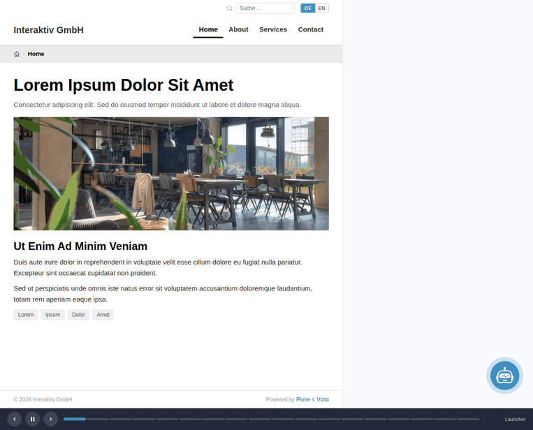
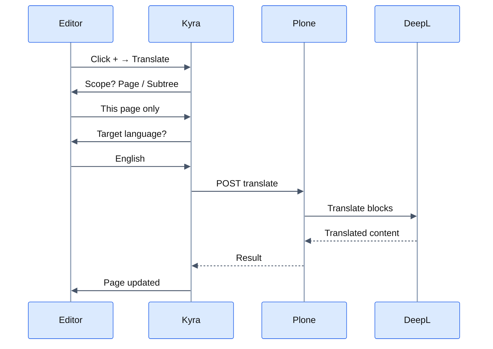
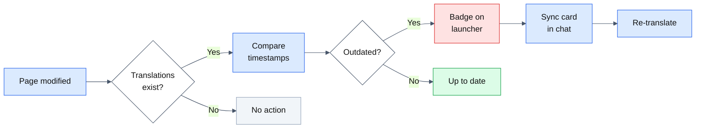
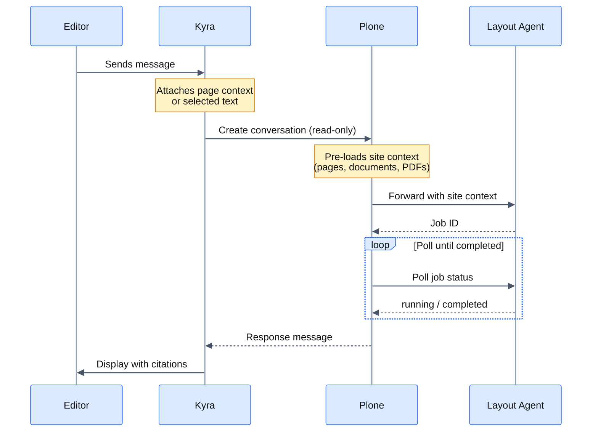
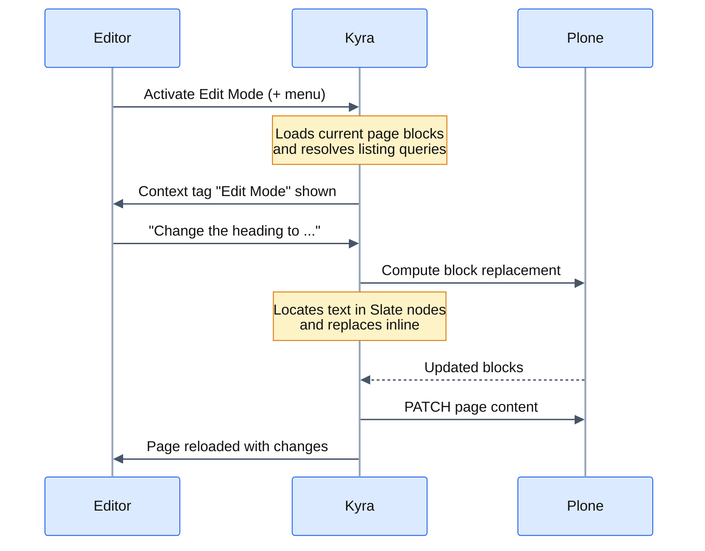
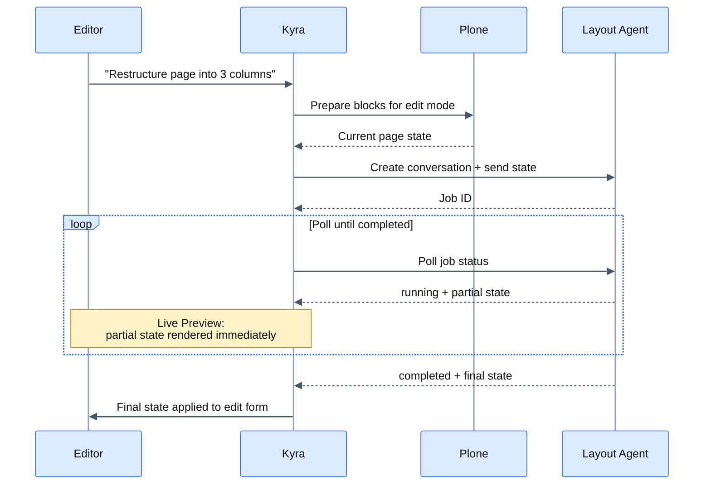
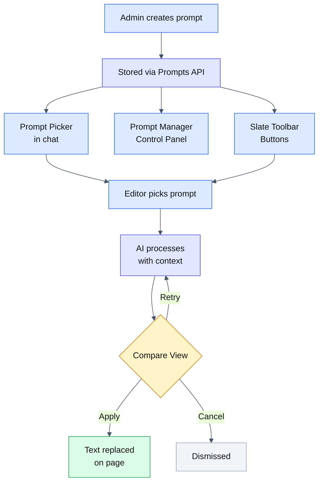
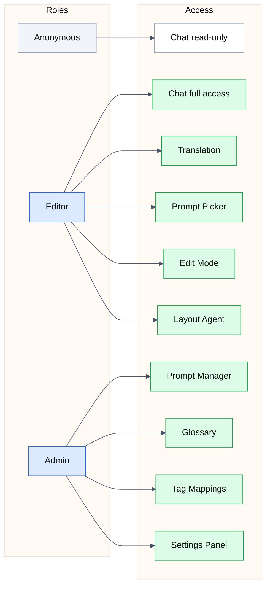

<div align="center">

# Kyra — AI Assistant for Volto

**Intelligent content assistant for Plone/Volto editors**
DeepL translation · AI chat · Live preview · Edit mode · Layout agent · Reference pages · Voice input · Prompt management · Widget customization

[](https://github.com/interaktivgmbh/volto-interaktiv-kyra)
[](LICENSE)
[](https://plone.org)
[](https://github.com/plone/volto)

<br/>



<sub>17 animated scenes — <a href="https://www.interaktiv.de/medien/svg/volto_ai_assistant-animation.svg/@@images/530130c3-ae54-4457-9d2d-2efaba8d59a4.svg">open interactive version</a></sub>

</div>

---

> **Live Demo** — Try Kyra at [spielwiese.interaktiv.de](https://spielwiese.interaktiv.de)
> Login: `demo` / `kyra-spielwiese-2026`
> The database resets daily — feel free to experiment.

---

## Contents

> **Features** — [Translation](#translation) · [Translation Sync](#translation-sync) · [AI Chat](#ai-chat) · [Voice Input](#voice-input) · [Edit Mode & Live Preview](#edit-mode) · [Layout Agent](#layout-agent) · [Reference Pages](#reference-pages) · [Text Selection](#text-selection) · [Prompts](#prompt-management) · [Slate Integration](#slate-editor-integration) · [File Attachments](#prompt-file-attachments) · [History](#chat-history) · [Permissions](#permission-matrix) · [Customization](#customization) · [Auto Error Reporting](#auto-error-reporting)
>
> **Technical** — [Architecture](#architecture) · [API Endpoints](#api-endpoints) · [Installation](#installation) · [Configuration](#configuration) · [Troubleshooting](#troubleshooting)

---

## Features

| Feature | Description |
|:--------|:------------|
| **DeepL Translation** | Translate pages or subtrees with glossary support |
| **Translation Sync** | Detect and update outdated translations |
| **AI Chat** | Context-aware chat with auto-generated citations from reference pages and attachments |
| **Voice Input** | Speech-to-text via Web Speech API for hands-free input |
| **Edit Mode** | Directly modify page content (headings, text, metadata) via chat |
| **Live Preview** | Real-time rendering of AI changes in the edit view during processing |
| **Layout Agent** | AI-driven page layout generation and block restructuring |
| **Reference Pages** | Neighboring pages (parent, siblings, children) sent as AI context |
| **Text Selection** | Select text on page as targeted AI context |
| **Prompt Manager** | Curated prompt library with compare view — available in chat panel and as Slate editor toolbar buttons |
| **Slate Editor Integration** | Prompt Manager and free-text prompts directly in the Slate rich-text editor toolbar |
| **Prompt File Attachments** | Upload reference files to prompts for additional context |
| **AI Assistant Run** | Execute prompts against selected text inline from the Slate toolbar |
| **Chat History** | Server-side per-user conversation history with pin, archive and rename |
| **Drag & Drop Upload** | Drop files directly into the chat composer for context |
| **Glossary** | DeepL glossary for consistent terminology |
| **Tag Mappings** | Keyword translation mappings |
| **Permission Matrix** | Fine-grained role-based access control per feature |
| **Customization** | Custom icon, accent color and chat name |
| **Auto Error Reporting** | Automatic GitHub issue creation on AI errors with optional auto-fix via Claude Code |
| **Audit Logging** | Server-side logging of all AI actions for compliance |

---

## Translation

Full DeepL integration in the editor workflow.


```mermaid
%%{init: {'theme': 'base', 'themeVariables': {'primaryColor': '#dbeafe', 'primaryBorderColor': '#2563eb', 'primaryTextColor': '#111', 'lineColor': '#475569', 'signalColor': '#475569', 'signalTextColor': '#111', 'labelTextColor': '#111', 'actorBkg': '#dbeafe', 'actorTextColor': '#111', 'actorBorder': '#2563eb', 'actorLineColor': '#94a3b8', 'noteBkgColor': '#fef3c7', 'noteBorderColor': '#d97706', 'noteTextColor': '#111'}}}%%
sequenceDiagram
    participant Editor
    participant Kyra
    participant Plone
    participant DeepL

    Editor->>Kyra: Click + → Translate
    Kyra->>Editor: Scope? Page / Subtree
    Editor->>Kyra: This page only
    Kyra->>Editor: Target language?
    Editor->>Kyra: English
    Kyra->>Plone: POST translate
    Plone->>DeepL: Translate blocks
    DeepL-->>Plone: Translated content
    Plone-->>Kyra: Result
    Kyra->>Editor: Page updated
```

- **Scope**: Single page or entire subtree with subpages
- **Languages**: DE to EN (extensible)
- **Modes**: Full overwrite or incremental (only changed blocks)
- **Glossary**: DeepL glossary entries respected during translation
- **Tag Mapping**: Keywords translated via configured mappings
- **Progress**: Visual overlay on the page during translation

### Glossary Management

Header menu, then **DeepL Glossary**: Add term pairs manually or bulk-import via CSV. Entries are synced to DeepL and used during all translations.

### Tag Mappings

Header menu, then **Tag Mappings**: Define per-language keyword translations. Tags without mapping are excluded from translated output.

---

## Translation Sync

Automatic detection and resolution of outdated translations.


```mermaid
%%{init: {'theme': 'base', 'themeVariables': {'primaryColor': '#dbeafe', 'primaryBorderColor': '#2563eb', 'primaryTextColor': '#111', 'lineColor': '#475569'}}}%%
flowchart LR
    A["Page modified"] --> B{"Translations\nexist?"}
    B -->|Yes| C["Compare\ntimestamps"]
    C --> D{"Outdated?"}
    D -->|Yes| E["Badge on\nlauncher"]
    E --> F["Sync card\nin chat"]
    F --> G["Re-translate"]
    D -->|No| I["Up to date"]
    B -->|No| J["No action"]

    style A fill:#dbeafe,stroke:#2563eb,color:#111
    style E fill:#fee2e2,stroke:#dc2626,color:#111
    style G fill:#dbeafe,stroke:#2563eb,color:#111
    style I fill:#dcfce7,stroke:#16a34a,color:#111
    style J fill:#f1f5f9,stroke:#94a3b8,color:#111
    style B fill:#fff,stroke:#475569,color:#111
    style D fill:#fff,stroke:#475569,color:#111
```

1. The translation status endpoint compares modification timestamps
2. Launcher button shows badge with outdated count
3. Sync card lists stale translations with URLs
4. One-click re-translation of affected pages

---

## AI Chat

Context-aware chat via the external Layout Agent backend (read-only mode).


```mermaid
%%{init: {'theme': 'base', 'themeVariables': {'primaryColor': '#dbeafe', 'primaryBorderColor': '#2563eb', 'primaryTextColor': '#111', 'lineColor': '#475569', 'signalColor': '#475569', 'signalTextColor': '#111', 'labelTextColor': '#111', 'actorBkg': '#dbeafe', 'actorTextColor': '#111', 'actorBorder': '#2563eb', 'actorLineColor': '#94a3b8', 'noteBkgColor': '#fef3c7', 'noteBorderColor': '#d97706', 'noteTextColor': '#111'}}}%%
sequenceDiagram
    participant Editor
    participant Kyra
    participant Plone
    participant Agent as Layout Agent

    Editor->>Kyra: Sends message
    Note over Kyra: Attaches page context<br/>or selected text
    Kyra->>Plone: Create conversation (read-only)
    Note over Plone: Pre-loads site context<br/>(pages, documents, PDFs)
    Plone->>Agent: Forward with site context
    Agent-->>Plone: Job ID
    loop Poll until completed
        Plone->>Agent: Poll job status
        Agent-->>Plone: running / completed
    end
    Plone-->>Kyra: Response message
    Kyra->>Editor: Display with citations
```

- **Site Context** — Plone pre-loads the site tree and document content (including PDF text extraction) and injects it into the first message
- **Citations** — auto-generated from reference pages (matched by title/link) and file attachments used as context
- **Feedback** — rate responses with thumbs up or down
- **File Upload** — attach documents (PDF, RTF) via button or drag & drop for additional context
- **Voice Input** — speech-to-text via Web Speech API with live transcription
- **Context Modes** — current page content, selected text, or site-wide
- **Abort** — cancel in-flight requests
- **Wizard Actions** — interactive buttons in assistant responses for guided workflows
- **Message Editing** — edit previously sent user messages inline
- **Auto-growing Input** — composer textarea grows with content (up to 150px)
- **Server-side History** — conversations stored per-user on the Plone backend

---

## Voice Input

Hands-free input via the browser's Web Speech API.

- Microphone button in the composer toolbar
- Live transcription during recording
- Automatic insertion into the message input
- Works alongside typed text and file attachments

---

## Edit Mode

Directly edit page content through AI instructions via the chat panel. Edit mode integrates with Volto's native `/edit` route — the chat panel opens automatically when entering the editor and the AI operates on the live form state via `setFormData`.


```mermaid
%%{init: {'theme': 'base', 'themeVariables': {'primaryColor': '#dbeafe', 'primaryBorderColor': '#2563eb', 'primaryTextColor': '#111', 'lineColor': '#475569', 'signalColor': '#475569', 'signalTextColor': '#111', 'labelTextColor': '#111', 'actorBkg': '#dbeafe', 'actorTextColor': '#111', 'actorBorder': '#2563eb', 'actorLineColor': '#94a3b8', 'noteBkgColor': '#fef3c7', 'noteBorderColor': '#d97706', 'noteTextColor': '#111'}}}%%
sequenceDiagram
    participant Editor
    participant Kyra
    participant Plone

    Editor->>Kyra: Activate Edit Mode (+ menu)
    Note over Kyra: Loads current page blocks<br/>and resolves listing queries
    Kyra->>Editor: Context tag "Edit Mode" shown
    Editor->>Kyra: "Change the heading to ..."
    Kyra->>Plone: Compute block replacement
    Note over Kyra: Locates text in Slate nodes<br/>and replaces inline
    Plone-->>Kyra: Updated blocks
    Kyra->>Plone: PATCH page content
    Kyra->>Editor: Page reloaded with changes
```

**How it works:**

1. Editor navigates to `/edit` — edit mode activates automatically and the chat panel opens
2. Current page blocks are loaded and prepared (including listing block resolution)
3. Each chat message is sent to the Layout Agent as an edit instruction
4. **Live Preview**: partial state updates are applied to the form in real-time as the agent processes — blocks appear one by one
5. The final state is injected into the Volto form via `setFormData`
6. The editor sees changes live in the form and can save or discard as usual
7. Edit mode state persists across page reloads via sessionStorage

**Live Preview** renders intermediate states during processing. Incomplete block structures (columns without content, accordions without panels, tables without rows) are automatically sanitized with safe defaults to prevent render crashes.

**Capabilities:**
- Modify text in any Slate-based block (paragraphs, headings, descriptions)
- Create, delete and rearrange blocks via natural language
- Modify page metadata (title, description, subjects, preview image)
- Reference pages provide broader site context to the AI agent
- Separate conversation IDs for chat vs edit mode

---

## Layout Agent

AI-driven page layout generation and restructuring through an external Layout Agent backend. The Layout Agent operates on the full Volto block structure and can create, rearrange, and modify blocks via natural language instructions.


```mermaid
%%{init: {'theme': 'base', 'themeVariables': {'primaryColor': '#dbeafe', 'primaryBorderColor': '#2563eb', 'primaryTextColor': '#111', 'lineColor': '#475569', 'signalColor': '#475569', 'signalTextColor': '#111', 'labelTextColor': '#111', 'actorBkg': '#dbeafe', 'actorTextColor': '#111', 'actorBorder': '#2563eb', 'actorLineColor': '#94a3b8', 'noteBkgColor': '#fef3c7', 'noteBorderColor': '#d97706', 'noteTextColor': '#111'}}}%%
sequenceDiagram
    participant Editor
    participant Kyra
    participant Plone
    participant Agent as Layout Agent

    Editor->>Kyra: "Restructure page into 3 columns"
    Kyra->>Plone: Prepare blocks for edit mode
    Plone-->>Kyra: Current page state
    Kyra->>Agent: Create conversation + send state
    Agent-->>Kyra: Job ID
    loop Poll until completed
        Kyra->>Agent: Poll job status
        Agent-->>Kyra: running + partial state
        Note over Kyra,Editor: Live Preview:<br/>partial state rendered immediately
    end
    Agent-->>Kyra: completed + final state
    Kyra->>Editor: Final state applied to edit form
```

**Architecture:**

- Communication via a Plone proxy (`@ai-edit-*` endpoints) to an external Layout Agent API
- Conversation-based: a layout conversation is created with the current page state, then messages are sent as edit instructions
- Asynchronous job processing with polling and cancel support
- The proxy handles authentication via Keycloak token

**Endpoints (proxied through Plone):**

| Endpoint | Purpose |
|:---------|:--------|
| `@ai-edit-conversations` | Create a new layout conversation with page state |
| `@ai-edit-messages` | Send an edit instruction to an existing conversation |
| `@ai-edit-jobs` | Poll the status of a running layout job |
| `@ai-edit-job-cancel` | Cancel a running layout job |

---

## Reference Pages

When creating a Layout Agent conversation, Kyra automatically fetches neighboring pages and sends them as read-only context. This enables the AI to answer questions about the broader site and to reuse content from related pages.

**Pages included:**
- **Parent page** — the direct parent in the content tree
- **Siblings** — up to 5 sibling pages at the same level
- **Children** — up to 5 child pages of the current page

Each reference page includes its full block content (`blocks`, `blocks_layout`) plus metadata (`title`, `description`, `subjects`). Fixed metadata blocks (e.g. `eventMetadata`) are automatically filtered out.

The Layout Agent can read these pages but not modify them.

---

## Text Selection

Select any text on the page to use it as targeted AI context.

- Selection detected via mouseup events
- Context tag **Selected Text** appears in the composer
- Dismissible to reset to page context
- Selected text sent alongside the prompt for targeted responses

---

## Prompt Management


```mermaid
%%{init: {'theme': 'base', 'themeVariables': {'primaryColor': '#dbeafe', 'primaryBorderColor': '#2563eb', 'primaryTextColor': '#111', 'lineColor': '#475569'}}}%%
flowchart TD
    A["Admin creates prompt"] --> B["Stored via Prompts API"]
    B --> C["Prompt Picker\nin chat"]
    B --> D["Prompt Manager\nControl Panel"]
    B --> E["Slate Toolbar\nButtons"]
    C --> F["Editor picks prompt"]
    E --> F
    F --> G["AI processes\nwith context"]
    G --> H{"Compare View"}
    H -->|"Apply"| I["Text replaced\non page"]
    H -->|"Retry"| G
    H -->|"Cancel"| J["Dismissed"]

    style A fill:#dbeafe,stroke:#2563eb,color:#111
    style B fill:#e0e7ff,stroke:#4f46e5,color:#111
    style C fill:#dbeafe,stroke:#2563eb,color:#111
    style D fill:#dbeafe,stroke:#2563eb,color:#111
    style E fill:#dbeafe,stroke:#2563eb,color:#111
    style G fill:#e0e7ff,stroke:#4f46e5,color:#111
    style H fill:#fef3c7,stroke:#d97706,color:#111
    style I fill:#dcfce7,stroke:#16a34a,color:#111
    style J fill:#f1f5f9,stroke:#94a3b8,color:#111
```

**Five ways to use prompts:**

1. **Prompt Picker** — browse saved prompts by category in the chat panel
2. **Slate Toolbar — Prompt Menu** — access the full Prompt Manager directly from the Slate editor toolbar while editing content
3. **Slate Toolbar — Free-Text** — type any custom prompt directly from the Slate toolbar with a chat overlay
4. **Prompt Manager** — full CRUD at Site Setup, AI Prompt Manager
5. **Free-Text in Chat** — type any custom prompt directly in the chat panel

**Compare View**: After processing, editors see Original vs. Result side-by-side with actions: Apply, Retry, Edit, Cancel.

**Action Types**: Each prompt defines an `actionType` — either `replace` (swap selected text) or `append` (add after selection).

### Prompt File Attachments

Prompts can include file attachments for additional reference context. Files are managed per-prompt via the Prompt Manager control panel:

- Upload multiple files per prompt (drag & drop or file picker)
- Preview uploaded files inline
- Files are stored server-side via the `@ai-prompt-files` API
- Supported formats: any file type the backend can process

---

## Slate Editor Integration

Two dedicated buttons are added to the Slate rich-text editor toolbar:

1. **AI Prompt Menu** (`AIAssistantButton`) — dropdown showing prompt categories on the left, prompt list on the right. Selecting a prompt executes it against the current editor selection via the `@ai-assistant-run` endpoint.

2. **AI Free-Text Chat** (`AIAssistantSlateButton`) — opens a chat overlay directly in the editor. Type any instruction, and the AI processes it against the selected text. Results can be applied (replace or append) or dismissed.

Both buttons support:
- Automatic extraction of the current Slate selection text
- Status indicators (running, success, error)
- HTML stripping from AI responses before insertion

---

## Chat History

- **Server-side storage** — conversations stored per-user in Plone annotations (device-independent)
- **Pin** important conversations to the top
- **Archive** conversations without deleting
- **Rename** conversation titles
- **Bulk actions** for multi-select delete and archive
- Auto-generated titles from first message content
- Device-specific settings (accent color, icon) remain in localStorage

---

## Permission Matrix

Administrators can configure fine-grained, role-based access control for each Kyra feature via the header menu (**Permissions**). The matrix defines which user groups can access:

| Feature | Description |
|:--------|:------------|
| **Chat** | Use the AI chat |
| **Translate** | Translate pages and subtrees |
| **Manage Glossary** | Edit DeepL glossary entries |
| **Manage Tag Mappings** | Edit keyword translation mappings |
| **Manage Prompts** | Create and edit prompts |
| **Manage Settings** | Access the settings drawer |
| **Assistant Run** | Execute prompts from the Slate toolbar |

Changes are saved via the `@ai-permission-matrix` endpoint and take effect immediately. The permission matrix is only visible to site administrators.

---

## Customization

Personalize via the settings drawer:

| Option | Description |
|:-------|:------------|
| **Launcher Icon** | Upload custom image or SVG |
| **Icon Color** | 8 preset colors |
| **Accent Color** | 6 presets: blue, green, amber, red, purple, pink |
| **Chat Name** | Replace default assistant name |

---

## Auto Error Reporting

When the AI assistant encounters an error, it can automatically create a GitHub issue with full context (error message, page URL, conversation state). An optional GitHub Action workflow then uses Claude Code to analyze and fix the bug automatically.

**Flow:**
1. AI response returns `status: 'error'`
2. Frontend calls `@ai-error-report` endpoint with error details
3. Backend creates a GitHub issue via the GitHub REST API with the `auto-reported` label
4. GitHub Action triggers, runs Claude Code to analyze and fix the issue
5. If a fix is found, a PR is created automatically

**Requirements:**
- `github_token` and `github_repo` configured in the Kyra control panel
- `.github/workflows/auto-fix-issue.yml` in the repository (included in this addon)

---

## Architecture


```mermaid
%%{init: {'theme': 'base', 'themeVariables': {'primaryColor': '#dbeafe', 'primaryBorderColor': '#2563eb', 'primaryTextColor': '#111', 'lineColor': '#475569'}}}%%
flowchart TD
    subgraph Frontend["Volto Frontend"]
        L["Launcher Button"] --> P["Chat Panel"]
        P --> Chat["Messages"]
        P --> Comp["Composer"]
        P --> Set["Settings"]
        P --> Hist["History"]
        P --> Gloss["Glossary"]
        P --> Tags["Tag Mappings"]
        P --> Prom["Prompt Picker"]
        P --> Edit["Edit Mode"]
        P --> Voice["Voice Input"]
        P --> RefPages["Reference Pages"]
        Slate["Slate Toolbar"] --> AIBtn["AI Prompt Menu"]
        Slate --> AIChat["AI Free-Text"]
    end

    subgraph Backend["Plone Backend"]
        C1["Chat API"]
        C2["Translate API"]
        C3["Prompts API"]
        C4["Glossary API"]
        C5["Tag Mappings API"]
        C6["Translation Status"]
        C7["Capabilities"]
        C8["Assistant Run"]
        C9["Prompt Files"]
        C10["Edit Proxy"]
        C11["Audit"]
        C12["Chat History"]
        C13["Error Report"]
    end

    subgraph Services["External Services"]
        GW["AI Gateway"]
        DL["DeepL API"]
        KC["Keycloak"]
        LA["Layout Agent"]
        GH["GitHub API"]
    end

    Chat <--> C1
    Comp --> C2
    Prom <--> C3
    Gloss <--> C4
    Tags <--> C5
    L --> C6
    L --> C7
    AIBtn --> C8
    AIChat --> C8
    Prom --> C9
    Edit --> C10
    Hist <--> C12
    Chat --> C13
    RefPages --> C10
    C1 --> GW
    C1 --> KC
    C2 --> DL
    C8 --> GW
    C10 --> LA
    C13 --> GH

    style L fill:#dbeafe,stroke:#2563eb,color:#111
    style P fill:#dbeafe,stroke:#2563eb,color:#111
    style Chat fill:#dbeafe,stroke:#2563eb,color:#111
    style Comp fill:#dbeafe,stroke:#2563eb,color:#111
    style Set fill:#dbeafe,stroke:#2563eb,color:#111
    style Hist fill:#dbeafe,stroke:#2563eb,color:#111
    style Gloss fill:#dbeafe,stroke:#2563eb,color:#111
    style Tags fill:#dbeafe,stroke:#2563eb,color:#111
    style Prom fill:#dbeafe,stroke:#2563eb,color:#111
    style Edit fill:#dbeafe,stroke:#2563eb,color:#111
    style Voice fill:#dbeafe,stroke:#2563eb,color:#111
    style RefPages fill:#dbeafe,stroke:#2563eb,color:#111
    style Slate fill:#dbeafe,stroke:#2563eb,color:#111
    style AIBtn fill:#dbeafe,stroke:#2563eb,color:#111
    style AIChat fill:#dbeafe,stroke:#2563eb,color:#111
    style C1 fill:#fff,stroke:#2563eb,color:#111
    style C2 fill:#fff,stroke:#2563eb,color:#111
    style C3 fill:#fff,stroke:#2563eb,color:#111
    style C4 fill:#fff,stroke:#2563eb,color:#111
    style C5 fill:#fff,stroke:#2563eb,color:#111
    style C6 fill:#fff,stroke:#2563eb,color:#111
    style C7 fill:#fff,stroke:#2563eb,color:#111
    style C8 fill:#fff,stroke:#2563eb,color:#111
    style C9 fill:#fff,stroke:#2563eb,color:#111
    style C10 fill:#fff,stroke:#2563eb,color:#111
    style C11 fill:#fff,stroke:#2563eb,color:#111
    style C12 fill:#fff,stroke:#2563eb,color:#111
    style C13 fill:#fff,stroke:#2563eb,color:#111
    style GW fill:#dcfce7,stroke:#16a34a,color:#111
    style DL fill:#dcfce7,stroke:#16a34a,color:#111
    style KC fill:#dcfce7,stroke:#16a34a,color:#111
    style LA fill:#dcfce7,stroke:#16a34a,color:#111
    style GH fill:#dcfce7,stroke:#16a34a,color:#111
```

### Permissions


```mermaid
%%{init: {'theme': 'base', 'themeVariables': {'primaryColor': '#dbeafe', 'primaryBorderColor': '#2563eb', 'primaryTextColor': '#111', 'lineColor': '#475569'}}}%%
flowchart LR
    subgraph Roles
        ANON["Anonymous"]
        EDITOR["Editor"]
        ADMIN["Admin"]
    end

    subgraph Access
        F1["Chat read-only"]
        F2["Chat full access"]
        F3["Translation"]
        F4["Prompt Picker"]
        F5["Prompt Manager"]
        F6["Glossary"]
        F7["Tag Mappings"]
        F8["Settings Panel"]
        F9["Edit Mode"]
        F10["Layout Agent"]
    end

    ANON --> F1
    EDITOR --> F2
    EDITOR --> F3
    EDITOR --> F4
    EDITOR --> F9
    EDITOR --> F10
    ADMIN --> F5
    ADMIN --> F6
    ADMIN --> F7
    ADMIN --> F8

    style ANON fill:#f1f5f9,stroke:#94a3b8,color:#111
    style EDITOR fill:#dbeafe,stroke:#2563eb,color:#111
    style ADMIN fill:#dbeafe,stroke:#2563eb,color:#111
    style F1 fill:#fff,stroke:#94a3b8,color:#111
    style F2 fill:#dcfce7,stroke:#16a34a,color:#111
    style F3 fill:#dcfce7,stroke:#16a34a,color:#111
    style F4 fill:#dcfce7,stroke:#16a34a,color:#111
    style F5 fill:#dcfce7,stroke:#16a34a,color:#111
    style F6 fill:#dcfce7,stroke:#16a34a,color:#111
    style F7 fill:#dcfce7,stroke:#16a34a,color:#111
    style F8 fill:#dcfce7,stroke:#16a34a,color:#111
    style F9 fill:#dcfce7,stroke:#16a34a,color:#111
    style F10 fill:#dcfce7,stroke:#16a34a,color:#111
```

---

## API Endpoints

| Method | Endpoint | Description |
|:-------|:---------|:------------|
| `POST` | `/@ai-chat` | Send message, receive streaming response |
| `POST` | `/@ai-chat-upload` | Upload file for chat context (PDF, RTF) |
| `POST` | `/@ai-feedback` | Submit message rating |
| `POST` | `/@ai-actions` | Translate page or subtree |
| `GET` | `/@ai-translation-status` | Outdated translation report |
| `GET/POST/PATCH/DELETE` | `/@ai-prompts` | Prompt CRUD |
| `GET/POST/DELETE` | `/@ai-prompt-files` | Prompt file attachment management |
| `POST` | `/@ai-assistant-run` | Execute prompt against selected text |
| `GET/POST/DELETE` | `/@ai-glossary` | Glossary management |
| `GET/POST/DELETE` | `/@ai-tag-mappings` | Tag mapping management |
| `GET` | `/@ai-capabilities` | Feature flags and permissions |
| `GET/POST` | `/@ai-permission-matrix` | Read/update role-based permission matrix |
| `POST` | `/@ai-edit-conversations` | Create layout agent conversation (edit mode, full permissions) |
| `POST` | `/@ai-edit-messages` | Send layout edit instruction |
| `GET` | `/@ai-edit-jobs` | Poll layout job status |
| `POST` | `/@ai-edit-job-cancel` | Cancel running layout job |
| `POST` | `/@ai-chat-conversations` | Create layout agent conversation (chat mode, read-only) |
| `POST` | `/@ai-chat-messages` | Send chat message to layout agent |
| `GET` | `/@ai-chat-jobs` | Poll chat job status |
| `POST` | `/@ai-chat-job-cancel` | Cancel running chat job |
| `GET/PATCH/PUT/DELETE` | `/@ai-chat-history` | Server-side per-user chat history |
| `POST` | `/@ai-error-report` | Auto-create GitHub issue from AI error |

---

## Installation

### Prerequisites

- **Plone 6** with [interaktiv.kyra](https://github.com/interaktivgmbh/interaktiv.kyra) backend addon
- **Volto 18+**

### Setup

**1.** Add to `mrs.developer.json`:

```json
{
  "volto-interaktiv-kyra": {
    "output": "packages",
    "package": "@interaktiv.de/volto-interaktiv-kyra",
    "url": "git@github.com:interaktivgmbh/volto-interaktiv-kyra.git",
    "path": "src",
    "branch": "main"
  }
}
```

**2.** Register in `package.json`:

```json
{
  "addons": ["@interaktiv.de/volto-interaktiv-kyra"],
  "dependencies": {
    "@interaktiv.de/volto-interaktiv-kyra": "workspace:*"
  }
}
```

**3.** Install:

```bash
pnpm install
```

---

## Configuration

Navigate to **Site Setup, Kyra AI Settings**:

| Setting | Description |
|:--------|:------------|
| `gateway_url` | AI gateway endpoint (required) |
| `keycloak_realms_url` | Keycloak auth URL (required) |
| `keycloak_client_id` | OAuth client ID (required) |
| `keycloak_client_secret` | OAuth client secret (required) |
| `keycloak_token_expiration_time` | Token cache TTL in seconds, `0` = no caching |
| `domain_id` | Domain identifier, default: `plone` |
| `deepl_api_key` | DeepL API key for translations |
| `edit_backend_url` | External Layout Agent backend URL — enables both chat and edit mode |
| `github_token` | GitHub personal access token for auto error reporting |
| `github_repo` | GitHub repository (e.g. `org/repo`) for auto error reporting |

---

## Troubleshooting

<details>
<summary><strong>Launcher button not visible</strong></summary>

- Verify `interaktiv.kyra` is installed in Plone
- Check `addons` in your project's `package.json`

</details>

<details>
<summary><strong>Translation fails</strong></summary>

- Check `deepl_api_key` in control panel
- Ensure backend can reach `api.deepl.com`

</details>

<details>
<summary><strong>Chat errors</strong></summary>

- Verify `gateway_url` and Keycloak credentials
- Check Plone instance logs

</details>

<details>
<summary><strong>Edit mode / Layout Agent not working</strong></summary>

- Verify `edit_backend_url` is set in the control panel
- Ensure the Layout Agent backend is running and reachable from Plone
- Keycloak credentials must be configured for authentication
- Review Plone logs for `[ai-edit-proxy]` or `[ai-chat-proxy]` messages

</details>

<details>
<summary><strong>Slate toolbar buttons missing</strong></summary>

- Ensure the `volto-interaktiv-kyra` addon is registered in `addons` and loaded
- The toolbar buttons require `interaktiv.kyra.actions.apply` permission (Editor role)

</details>

<details>
<summary><strong>Missing menu items</strong></summary>

- Glossary, tag mappings and prompt manager require editor or admin permissions
- Check capabilities endpoint response

</details>

---

<div align="center">

**Built with** [Plone](https://plone.org) · [Volto](https://github.com/plone/volto) · [DeepL](https://www.deepl.com)

**Maintained by** [Interaktiv GmbH](https://www.interaktiv.de)

Explore our other AI + Plone projects at [interaktiv.de/plone/ki-und-plone](https://www.interaktiv.de/plone/ki-und-plone)

</div>
