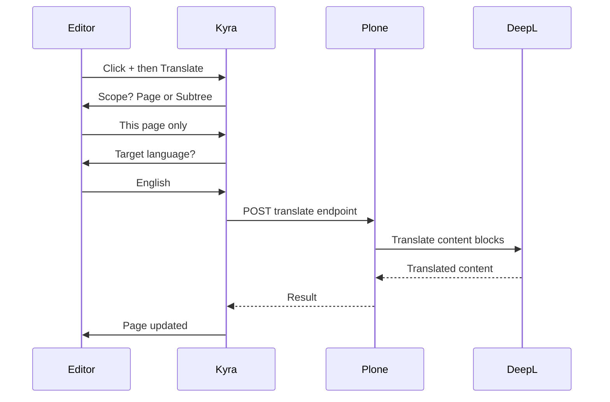
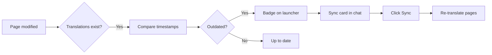
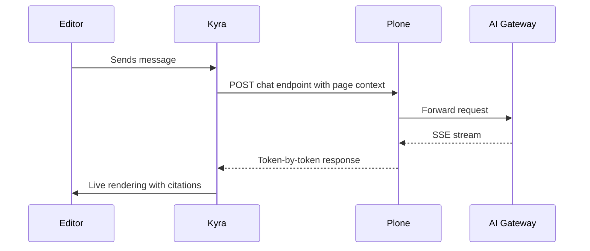
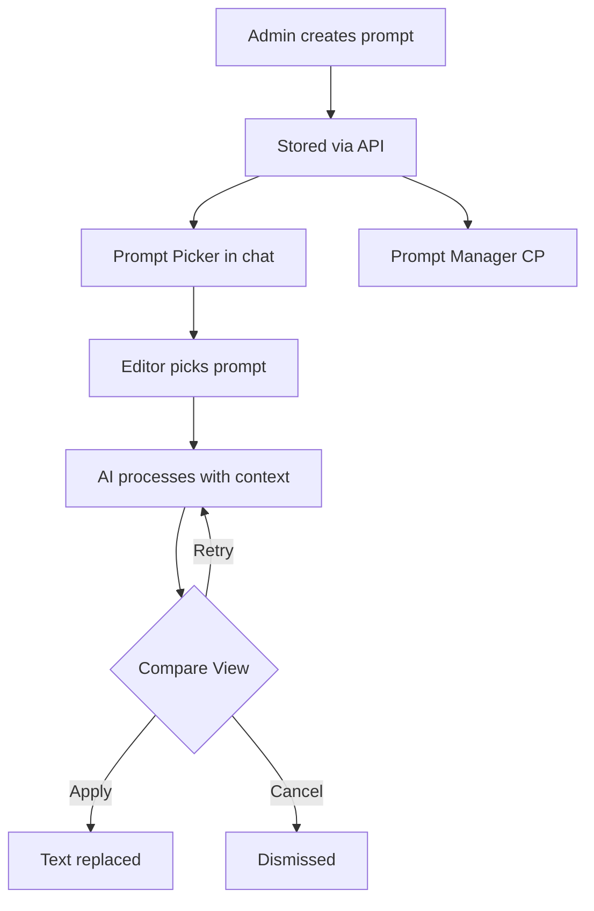
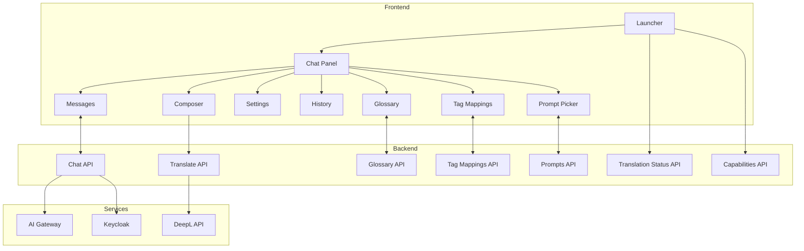
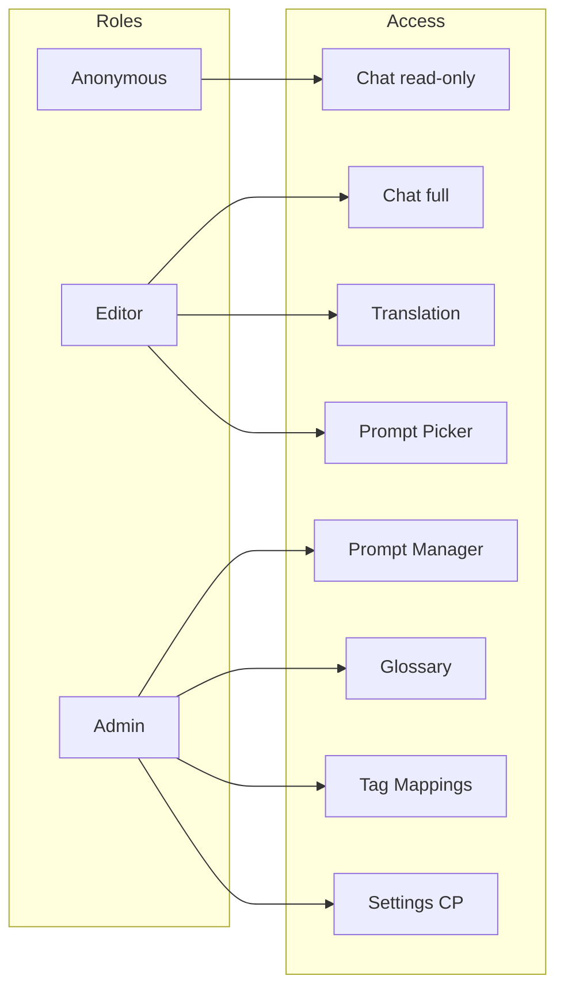

<div align="center">

# Kyra — AI Assistant for Volto

**Intelligent content assistant for Plone/Volto editors**
DeepL translation · AI chat · Prompt management · Widget customization

[](https://github.com/interaktivgmbh/volto-interaktiv-kyra)
[](LICENSE)
[](https://plone.org)
[](https://github.com/plone/volto)

**[Open Interactive Showcase](showcase/bot-showcase.svg)** — 17 animated scenes demonstrating all features

</div>

---

## Features

| Feature | Description |
|:--------|:------------|
| **DeepL Translation** | Translate pages or subtrees with glossary support |
| **Translation Sync** | Detect and update outdated translations |
| **AI Chat** | Streaming chat with citations and page context |
| **Text Selection** | Select text on page as targeted AI context |
| **Prompt Manager** | Curated prompt library with compare view |
| **Chat History** | Pin, archive, rename conversations |
| **Glossary** | DeepL glossary for consistent terminology |
| **Tag Mappings** | Keyword translation mappings |
| **Customization** | Custom icon, accent color and chat name |

---

## Translation

Full DeepL integration in the editor workflow.


```mermaid
sequenceDiagram
    participant Editor
    participant Kyra
    participant Plone
    participant DeepL

    Editor->>Kyra: Click + then Translate
    Kyra->>Editor: Scope? Page or Subtree
    Editor->>Kyra: This page only
    Kyra->>Editor: Target language?
    Editor->>Kyra: English
    Kyra->>Plone: POST translate endpoint
    Plone->>DeepL: Translate content blocks
    DeepL-->>Plone: Translated content
    Plone-->>Kyra: Result
    Kyra->>Editor: Page updated
```

- **Scope**: Single page or entire subtree with subpages
- **Languages**: DE to EN (extensible)
- **Modes**: Full overwrite or incremental (only changed blocks)
- **Glossary**: DeepL glossary entries respected during translation
- **Tag Mapping**: Keywords translated via configured mappings
- **Progress**: Visual overlay on the page during translation

### Glossary Management

Header menu, then **DeepL Glossary**: Add term pairs manually or bulk-import via CSV. Entries are synced to DeepL and used during all translations.

### Tag Mappings

Header menu, then **Tag Mappings**: Define per-language keyword translations. Tags without mapping are excluded from translated output.

---

## Translation Sync

Automatic detection and resolution of outdated translations.


```mermaid
flowchart LR
    A["Page modified"] --> B{"Translations exist?"}
    B -->|Yes| C["Compare timestamps"]
    C --> D{"Outdated?"}
    D -->|Yes| E["Badge on launcher"]
    E --> F["Sync card in chat"]
    F --> G["Click Sync"]
    G --> H["Re-translate pages"]
    D -->|No| I["Up to date"]
```

1. The translation status endpoint compares modification timestamps
2. Launcher button shows badge with outdated count
3. Sync card lists stale translations with URLs
4. One-click re-translation of affected pages

---

## AI Chat

Context-aware streaming chat with citations.


```mermaid
sequenceDiagram
    participant Editor
    participant Kyra
    participant Plone
    participant AI as AI Gateway

    Editor->>Kyra: Sends message
    Kyra->>Plone: POST chat endpoint with page context
    Plone->>AI: Forward request
    AI-->>Plone: SSE stream
    Plone-->>Kyra: Token-by-token response
    Kyra->>Editor: Live rendering with citations
```

- **Streaming** via Server-Sent Events with real-time token rendering
- **Citations** with source links and snippets
- **Feedback** — rate responses with thumbs up or down
- **File Upload** — attach documents for additional context
- **Context Modes** — current page content or selected text
- **Abort** — cancel in-flight requests

---

## Text Selection

Select any text on the page to use it as targeted AI context.

- Selection detected via mouseup events
- Context tag **Selected Text** appears in the composer
- Dismissible to reset to page context
- Selected text sent alongside the prompt for targeted responses

---

## Prompt Management


```mermaid
flowchart TD
    A["Admin creates prompt"] --> B["Stored via API"]
    B --> C["Prompt Picker in chat"]
    B --> D["Prompt Manager CP"]
    C --> E["Editor picks prompt"]
    E --> F["AI processes with context"]
    F --> G{"Compare View"}
    G -->|Apply| H["Text replaced"]
    G -->|Retry| F
    G -->|Cancel| I["Dismissed"]
```

**Three ways to use prompts:**

1. **Prompt Picker** — browse saved prompts by category in the chat panel
2. **Prompt Manager** — full CRUD at Site Setup, AI Prompt Manager
3. **Free-Text** — type any custom prompt directly

**Compare View**: After processing, editors see Original vs. Result side-by-side with actions: Apply, Retry, Edit, Cancel.

---

## Chat History

- Persistent per-user conversation history in localStorage
- **Pin** important conversations to the top
- **Archive** conversations without deleting
- **Rename** conversation titles
- **Bulk actions** for multi-select delete and archive
- Auto-generated titles from first message content

---

## Customization

Personalize via the settings drawer:

| Option | Description |
|:-------|:------------|
| **Launcher Icon** | Upload custom image or SVG |
| **Icon Color** | 8 preset colors |
| **Accent Color** | 6 presets: blue, green, amber, red, purple, pink |
| **Chat Name** | Replace default assistant name |

---

## Architecture


```mermaid
flowchart TD
    subgraph Frontend
        L["Launcher"] --> P["Chat Panel"]
        P --> Chat["Messages"]
        P --> Comp["Composer"]
        P --> Set["Settings"]
        P --> Hist["History"]
        P --> Gloss["Glossary"]
        P --> Tags["Tag Mappings"]
        P --> Prom["Prompt Picker"]
    end

    subgraph Backend
        C1["Chat API"]
        C2["Translate API"]
        C3["Prompts API"]
        C4["Glossary API"]
        C5["Tag Mappings API"]
        C6["Translation Status API"]
        C7["Capabilities API"]
    end

    subgraph Services
        GW["AI Gateway"]
        DL["DeepL API"]
        KC["Keycloak"]
    end

    Chat <--> C1
    Comp --> C2
    Prom <--> C3
    Gloss <--> C4
    Tags <--> C5
    L --> C6
    L --> C7
    C1 --> GW
    C1 --> KC
    C2 --> DL
```

### Permissions


```mermaid
flowchart LR
    subgraph Roles
        ANON["Anonymous"]
        EDITOR["Editor"]
        ADMIN["Admin"]
    end

    subgraph Access
        F1["Chat read-only"]
        F2["Chat full"]
        F3["Translation"]
        F4["Prompt Picker"]
        F5["Prompt Manager"]
        F6["Glossary"]
        F7["Tag Mappings"]
        F8["Settings CP"]
    end

    ANON --> F1
    EDITOR --> F2
    EDITOR --> F3
    EDITOR --> F4
    ADMIN --> F5
    ADMIN --> F6
    ADMIN --> F7
    ADMIN --> F8
```

---

## API Endpoints

| Method | Endpoint | Description |
|:-------|:---------|:------------|
| `POST` | `/@ai-chat` | Send message, receive streaming response |
| `POST` | `/@ai-chat-upload` | Upload file for chat context |
| `POST` | `/@ai-feedback` | Submit message rating |
| `POST` | `/@ai-translate` | Translate page or subtree |
| `GET` | `/@ai-translation-status` | Outdated translation report |
| `GET/POST/PATCH/DELETE` | `/@ai-prompts` | Prompt CRUD |
| `GET/POST/DELETE` | `/@ai-glossary` | Glossary management |
| `GET/POST/DELETE` | `/@ai-tag-mappings` | Tag mapping management |
| `GET` | `/@ai-capabilities` | Feature flags and permissions |

---

## Installation

### Prerequisites

- **Plone 6** with [interaktiv.kyra](https://github.com/interaktivgmbh/interaktiv.kyra) backend addon
- **Volto 18+** with `@kitconcept/volto-light-theme`

### Setup

**1.** Add to `mrs.developer.json`:

```json
{
  "volto-interaktiv-kyra": {
    "output": "packages",
    "package": "@interaktiv.de/volto-interaktiv-kyra",
    "url": "git@github.com:interaktivgmbh/volto-interaktiv-kyra.git",
    "path": "src",
    "branch": "main"
  }
}
```

**2.** Register in `package.json`:

```json
{
  "addons": ["@interaktiv.de/volto-interaktiv-kyra"]
}
```

**3.** Install:

```bash
pnpm install
```

---

## Configuration

Navigate to **Site Setup, Kyra AI Settings**:

| Setting | Description |
|:--------|:------------|
| `gateway_url` | AI gateway endpoint (required) |
| `keycloak_realms_url` | Keycloak auth URL (required) |
| `keycloak_client_id` | OAuth client ID (required) |
| `keycloak_client_secret` | OAuth client secret (required) |
| `domain_id` | Domain identifier, default: `plone` |
| `deepl_api_key` | DeepL API key for translations |

---

## Theming

Override CSS variables to match your design:

```css
:root {
  --ai-chat-accent: #3b97d4;
  --ai-chat-accent-strong: #307db0;
  --ai-chat-bg: #f8fafc;
  --ai-chat-text: #000;
  --ai-chat-muted: #64748b;
  --ai-chat-border: rgba(148, 163, 184, 0.3);
  --ai-chat-radius: 18px;
}
```

---

## Troubleshooting

<details>
<summary><strong>Launcher button not visible</strong></summary>

- Verify `interaktiv.kyra` is installed in Plone
- Check `addons` in your project's `package.json`

</details>

<details>
<summary><strong>Translation fails</strong></summary>

- Check `deepl_api_key` in control panel
- Ensure backend can reach `api.deepl.com`

</details>

<details>
<summary><strong>Chat errors</strong></summary>

- Verify `gateway_url` and Keycloak credentials
- Check Plone instance logs

</details>

<details>
<summary><strong>Missing menu items</strong></summary>

- Glossary, tag mappings and prompt manager require editor or admin permissions
- Check capabilities endpoint response

</details>

---

<div align="center">

**Built with** [Plone](https://plone.org) · [Volto](https://github.com/plone/volto) · [DeepL](https://www.deepl.com)

**Maintained by** [Interaktiv GmbH](https://www.interaktiv.de)

</div>
